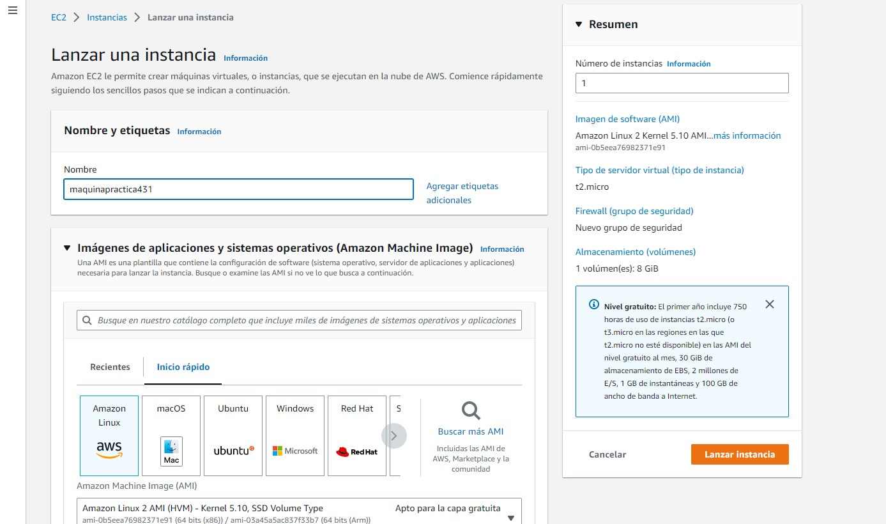
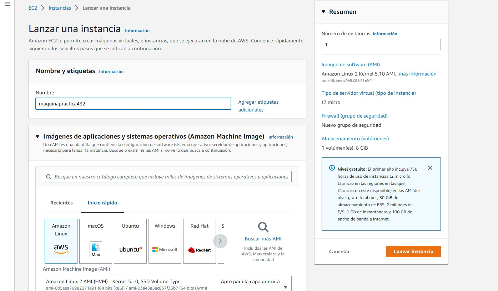
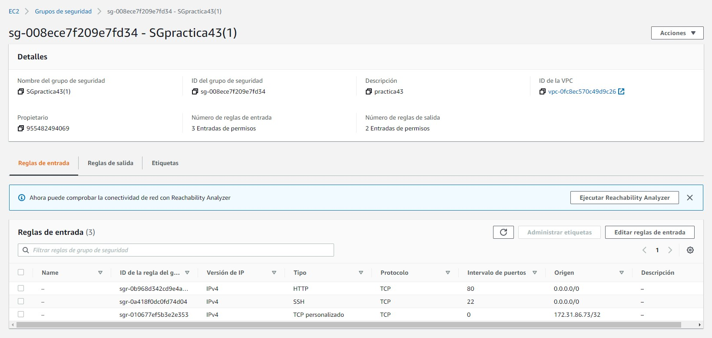
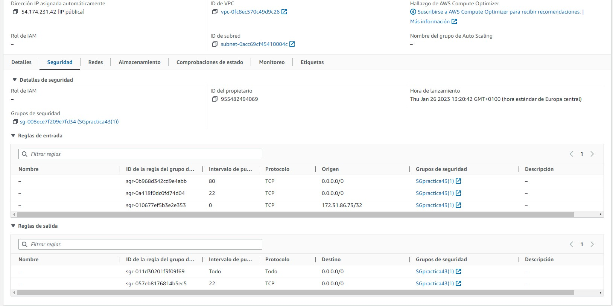
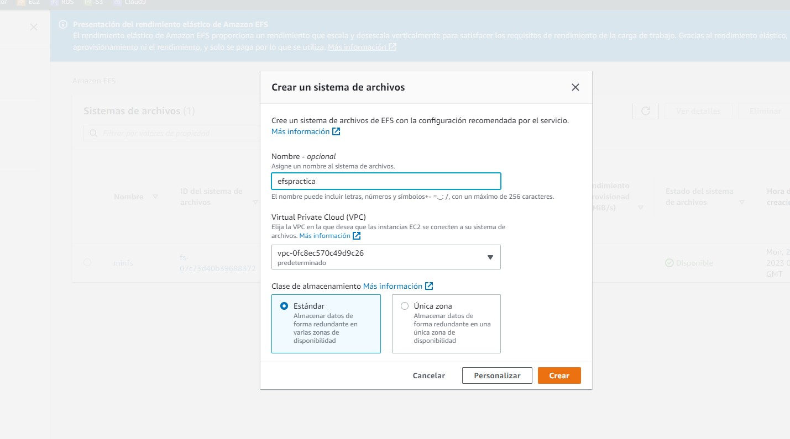
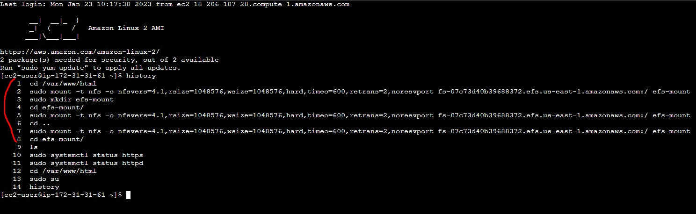
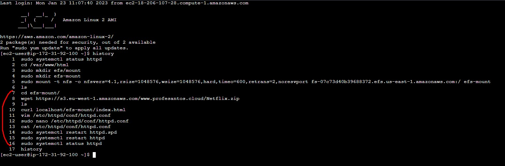

# CAPTURAS
* 
* 
* 
* 
---
* 
* 
* 
* 
---
* 
* 
---
* 
* 
---
* 
* 
---
* 
* 
---
* 
---
## IP BALANCEADOR
* http://107.21.30.247/

---
## APARTADO DONACIONES

### El primer paso de todo es crear una instancia RDS con características normales salvo que esta se encuentra en estado de producción. Tras esto los pasos serán los siguientes
* Agregamos al archivo index.html un botón para donativos para Turquía y Siria y nuestro nombre en el header
.jpg)
.jpg)

* Luego modificaremos el archivo style.css según lo indicado en clase
.jpg)

* A continuación modificaremos el archivo formulario.php, aplicándole la hoja de estilos dicha previamente
.jpg)
.jpg)

* Tras esto modificaremos el archivo grabar.php para que guarde los valores introducidos en el formulario dentro de la base de datos
.jpg)
.jpg)

* Por último editaremos el archivo conexión.php con los parámetros determinados en la rds (Su puerta de enlace, usuario, contraseña y base de datos establecidos)
.jpg)
.jpg)